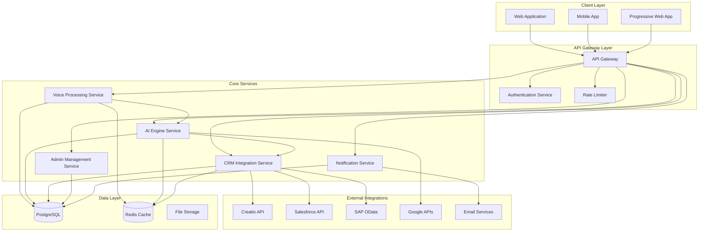

# Design Document

## Overview

The Nia AI Sales Assistant is designed as a modular, scalable system that combines voice-based AI interaction with comprehensive CRM integration and administrative capabilities. The architecture follows a microservices approach with clear separation of concerns, enabling independent scaling and maintenance of different system components.

The system is built around three core pillars:
1. **Voice-First AI Interface** - Natural language processing with Indian English accent support
2. **Multi-CRM Integration Hub** - Unified API layer for Creatio, Salesforce, and SAP
3. **Administrative Foundation** - User management, security, and system configuration

## Architecture

### High-Level System Architecture



### Service Architecture Details

#### 1. Voice Processing Service
- **Speech-to-Text (STT)**: Google Speech-to-Text API with `en-IN` locale
- **Text-to-Speech (TTS)**: Google Text-to-Speech for natural responses
- **Audio Processing**: Real-time audio streaming and noise reduction
- **Voice Training**: User-specific voice profile management

#### 2. AI Engine Service
- **LLM Integration**: Gemini Pro / GPT-4 for natural language understanding
- **Intent Detection**: Custom NLP pipeline for sales-specific intents
- **Context Management**: Conversation memory and context preservation
- **Response Generation**: Contextual and personalized response creation

#### 3. CRM Integration Service
- **Unified API Layer**: Abstraction over multiple CRM systems
- **Data Synchronization**: Real-time sync with external CRM systems
- **Webhook Management**: Handling CRM webhooks and events
- **Conflict Resolution**: Managing data conflicts across systems

## Components and Interfaces

### Frontend Components

#### Web Application (React.js + Tailwind CSS)
```typescript
// Core Components Structure
src/
├── components/
│   ├── admin/
│   │   ├── UserManagement.tsx
│   │   ├── SystemDashboard.tsx
│   │   ├── CRMConfiguration.tsx
│   │   └── AnalyticsDashboard.tsx
│   ├── voice/
│   │   ├── VoiceInterface.tsx
│   │   ├── AudioVisualizer.tsx
│   │   └── ConversationHistory.tsx
│   ├── crm/
│   │   ├── LeadManagement.tsx
│   │   ├── TaskManager.tsx
│   │   └── MeetingScheduler.tsx
│   └── common/
│       ├── Layout.tsx
│       ├── Navigation.tsx
│       └── NotificationCenter.tsx
├── services/
│   ├── api.ts
│   ├── websocket.ts
│   └── audio.ts
└── hooks/
    ├── useVoice.ts
    ├── useAuth.ts
    └── useCRM.ts
```

#### Mobile Application (React Native)
```typescript
// Mobile-Specific Components
src/
├── screens/
│   ├── VoiceAssistant.tsx
│   ├── Dashboard.tsx
│   ├── LeadsList.tsx
│   └── Settings.tsx
├── components/
│   ├── VoicePushToTalk.tsx
│   ├── OfflineIndicator.tsx
│   └── NotificationHandler.tsx
└── services/
    ├── offlineStorage.ts
    ├── backgroundSync.ts
    └── pushNotifications.ts
```

### Backend Services

#### API Gateway (Node.js + Express)
```typescript
// Gateway Configuration
interface GatewayConfig {
  routes: {
    '/api/voice': VoiceService;
    '/api/ai': AIService;
    '/api/crm': CRMService;
    '/api/admin': AdminService;
    '/api/notifications': NotificationService;
  };
  middleware: {
    authentication: JWTMiddleware;
    rateLimiting: RateLimitMiddleware;
    logging: AuditMiddleware;
  };
}
```

#### Voice Processing Service
```typescript
interface VoiceService {
  // Speech Recognition
  processAudio(audioStream: Buffer): Promise<TranscriptionResult>;
  
  // Text-to-Speech
  synthesizeSpeech(text: string, voiceConfig: VoiceConfig): Promise<AudioBuffer>;
  
  // Voice Training
  trainVoiceProfile(userId: string, samples: AudioSample[]): Promise<VoiceProfile>;
  
  // Real-time Processing
  startVoiceSession(userId: string): WebSocketConnection;
}

interface TranscriptionResult {
  text: string;
  confidence: number;
  language: string;
  timestamp: Date;
}
```

#### AI Engine Service
```typescript
interface AIService {
  // Intent Detection
  detectIntent(text: string, context: ConversationContext): Promise<IntentResult>;
  
  // Response Generation
  generateResponse(intent: IntentResult, userData: UserData): Promise<AIResponse>;
  
  // Context Management
  updateContext(userId: string, context: ConversationContext): Promise<void>;
  getContext(userId: string): Promise<ConversationContext>;
  
  // Multi-language Support
  processMultiLanguage(text: string, languages: string[]): Promise<ProcessedText>;
}

interface IntentResult {
  intent: string;
  entities: Record<string, any>;
  confidence: number;
  requiredActions: Action[];
}
```

#### CRM Integration Service
```typescript
interface CRMService {
  // Unified CRM Operations
  createLead(crmType: CRMType, leadData: LeadData): Promise<CRMResponse>;
  updateLead(crmType: CRMType, leadId: string, updates: Partial<LeadData>): Promise<CRMResponse>;
  searchRecords(crmType: CRMType, query: SearchQuery): Promise<CRMRecord[]>;
  
  // Task Management
  createTask(crmType: CRMType, taskData: TaskData): Promise<CRMResponse>;
  getTasks(crmType: CRMType, filters: TaskFilters): Promise<Task[]>;
  
  // Meeting Management
  scheduleMeeting(crmType: CRMType, meetingData: MeetingData): Promise<CRMResponse>;
  
  // Configuration
  configureCRM(crmType: CRMType, config: CRMConfig): Promise<void>;
  testConnection(crmType: CRMType): Promise<ConnectionStatus>;
}

enum CRMType {
  CREATIO = 'creatio',
  SALESFORCE = 'salesforce',
  SAP = 'sap'
}
```

## Data Models

### Core Database Schema

#### Users and Authentication
```sql
-- Users table
CREATE TABLE users (
    id UUID PRIMARY KEY DEFAULT gen_random_uuid(),
    email VARCHAR(255) UNIQUE NOT NULL,
    password_hash VARCHAR(255) NOT NULL,
    first_name VARCHAR(100) NOT NULL,
    last_name VARCHAR(100) NOT NULL,
    role_id UUID REFERENCES roles(id),
    is_active BOOLEAN DEFAULT true,
    created_at TIMESTAMP DEFAULT CURRENT_TIMESTAMP,
    updated_at TIMESTAMP DEFAULT CURRENT_TIMESTAMP
);

-- Roles and permissions
CREATE TABLE roles (
    id UUID PRIMARY KEY DEFAULT gen_random_uuid(),
    name VARCHAR(50) UNIQUE NOT NULL,
    description TEXT,
    permissions JSONB NOT NULL
);

-- User sessions
CREATE TABLE user_sessions (
    id UUID PRIMARY KEY DEFAULT gen_random_uuid(),
    user_id UUID REFERENCES users(id) ON DELETE CASCADE,
    token_hash VARCHAR(255) NOT NULL,
    expires_at TIMESTAMP NOT NULL,
    created_at TIMESTAMP DEFAULT CURRENT_TIMESTAMP
);
```

#### Voice and AI Data
```sql
-- Voice profiles
CREATE TABLE voice_profiles (
    id UUID PRIMARY KEY DEFAULT gen_random_uuid(),
    user_id UUID REFERENCES users(id) ON DELETE CASCADE,
    profile_data JSONB NOT NULL,
    language_preferences TEXT[] DEFAULT ARRAY['en-IN'],
    created_at TIMESTAMP DEFAULT CURRENT_TIMESTAMP,
    updated_at TIMESTAMP DEFAULT CURRENT_TIMESTAMP
);

-- Conversation history
CREATE TABLE conversations (
    id UUID PRIMARY KEY DEFAULT gen_random_uuid(),
    user_id UUID REFERENCES users(id) ON DELETE CASCADE,
    session_id VARCHAR(255) NOT NULL,
    messages JSONB NOT NULL,
    context JSONB,
    created_at TIMESTAMP DEFAULT CURRENT_TIMESTAMP
);

-- Intent logs
CREATE TABLE intent_logs (
    id UUID PRIMARY KEY DEFAULT gen_random_uuid(),
    user_id UUID REFERENCES users(id),
    input_text TEXT NOT NULL,
    detected_intent VARCHAR(100),
    confidence DECIMAL(3,2),
    entities JSONB,
    response_text TEXT,
    created_at TIMESTAMP DEFAULT CURRENT_TIMESTAMP
);
```

#### CRM Integration Data
```sql
-- CRM configurations
CREATE TABLE crm_configurations (
    id UUID PRIMARY KEY DEFAULT gen_random_uuid(),
    user_id UUID REFERENCES users(id) ON DELETE CASCADE,
    crm_type VARCHAR(50) NOT NULL,
    config_data JSONB NOT NULL,
    is_active BOOLEAN DEFAULT true,
    created_at TIMESTAMP DEFAULT CURRENT_TIMESTAMP,
    updated_at TIMESTAMP DEFAULT CURRENT_TIMESTAMP
);

-- CRM sync logs
CREATE TABLE crm_sync_logs (
    id UUID PRIMARY KEY DEFAULT gen_random_uuid(),
    user_id UUID REFERENCES users(id),
    crm_type VARCHAR(50) NOT NULL,
    operation VARCHAR(50) NOT NULL,
    record_type VARCHAR(50),
    record_id VARCHAR(255),
    status VARCHAR(20) NOT NULL,
    error_message TEXT,
    created_at TIMESTAMP DEFAULT CURRENT_TIMESTAMP
);

-- Cached CRM data
CREATE TABLE crm_cache (
    id UUID PRIMARY KEY DEFAULT gen_random_uuid(),
    user_id UUID REFERENCES users(id) ON DELETE CASCADE,
    crm_type VARCHAR(50) NOT NULL,
    record_type VARCHAR(50) NOT NULL,
    record_id VARCHAR(255) NOT NULL,
    data JSONB NOT NULL,
    expires_at TIMESTAMP NOT NULL,
    created_at TIMESTAMP DEFAULT CURRENT_TIMESTAMP
);
```

### TypeScript Data Models

```typescript
// User Management
interface User {
  id: string;
  email: string;
  firstName: string;
  lastName: string;
  role: Role;
  isActive: boolean;
  createdAt: Date;
  updatedAt: Date;
}

interface Role {
  id: string;
  name: string;
  description: string;
  permissions: Permission[];
}

// Voice and AI
interface VoiceProfile {
  id: string;
  userId: string;
  profileData: VoiceProfileData;
  languagePreferences: string[];
  createdAt: Date;
  updatedAt: Date;
}

interface ConversationContext {
  userId: string;
  sessionId: string;
  currentTopic: string;
  entities: Record<string, any>;
  history: ConversationMessage[];
  lastActivity: Date;
}

// CRM Data
interface LeadData {
  name: string;
  email: string;
  phone?: string;
  company: string;
  title?: string;
  source?: string;
  status: LeadStatus;
  customFields?: Record<string, any>;
}

interface TaskData {
  title: string;
  description?: string;
  dueDate: Date;
  priority: TaskPriority;
  assignedTo?: string;
  relatedRecordId?: string;
  relatedRecordType?: string;
}

interface MeetingData {
  title: string;
  description?: string;
  startTime: Date;
  endTime: Date;
  participants: string[];
  location?: string;
  meetingLink?: string;
}
```

## Error Handling

### Error Classification System
```typescript
enum ErrorType {
  AUTHENTICATION = 'AUTHENTICATION',
  AUTHORIZATION = 'AUTHORIZATION',
  VALIDATION = 'VALIDATION',
  VOICE_PROCESSING = 'VOICE_PROCESSING',
  AI_PROCESSING = 'AI_PROCESSING',
  CRM_INTEGRATION = 'CRM_INTEGRATION',
  NETWORK = 'NETWORK',
  SYSTEM = 'SYSTEM'
}

interface ErrorResponse {
  type: ErrorType;
  code: string;
  message: string;
  details?: Record<string, any>;
  timestamp: Date;
  requestId: string;
}
```

### Error Handling Strategies

#### Voice Processing Errors
- **Audio Quality Issues**: Automatic noise reduction and user feedback
- **Recognition Failures**: Fallback to text input with voice retry option
- **Language Detection**: Multi-language processing with confidence scoring

#### AI Processing Errors
- **Intent Ambiguity**: Clarification questions with context preservation
- **Context Loss**: Graceful degradation with conversation summary
- **Response Generation**: Fallback templates with personalization

#### CRM Integration Errors
- **API Failures**: Retry logic with exponential backoff
- **Authentication Issues**: Automatic token refresh and re-authentication
- **Data Conflicts**: Conflict resolution UI with user choice

## Testing Strategy

### Testing Pyramid

#### Unit Tests (70%)
- **Voice Processing**: Audio processing algorithms and speech recognition accuracy
- **AI Engine**: Intent detection, entity extraction, and response generation
- **CRM Integration**: API client libraries and data transformation
- **Admin Services**: User management, authentication, and authorization

#### Integration Tests (20%)
- **Service Communication**: API contracts and message passing
- **Database Operations**: Data consistency and transaction handling
- **External API Integration**: CRM system connectivity and data sync
- **Authentication Flow**: End-to-end user authentication and session management

#### End-to-End Tests (10%)
- **Voice Workflows**: Complete voice-to-CRM operation flows
- **User Journeys**: Critical user paths through the application
- **Cross-Platform**: Web and mobile application consistency
- **Performance**: Load testing and response time validation

### Testing Tools and Frameworks

```typescript
// Testing Configuration
interface TestConfig {
  unit: {
    framework: 'Jest';
    coverage: 90;
    mocking: 'jest.mock';
  };
  integration: {
    framework: 'Supertest';
    database: 'TestContainers';
    apis: 'Nock';
  };
  e2e: {
    framework: 'Playwright';
    browsers: ['Chrome', 'Firefox', 'Safari'];
    mobile: 'Appium';
  };
  performance: {
    load: 'Artillery';
    monitoring: 'New Relic';
  };
}
```

### Voice Testing Strategy
- **Accent Validation**: Test suite with various Indian English accents
- **Noise Handling**: Background noise simulation and filtering tests
- **Language Switching**: Code-switching between English and Hindi
- **Voice Profile Training**: Accuracy improvement measurement

### AI Testing Strategy
- **Intent Accuracy**: Comprehensive intent classification test suite
- **Entity Extraction**: Named entity recognition validation
- **Context Preservation**: Multi-turn conversation testing
- **Response Quality**: Human evaluation and automated scoring

### CRM Integration Testing
- **API Compatibility**: Version compatibility across CRM systems
- **Data Integrity**: Round-trip data validation
- **Error Scenarios**: Network failures and API limit testing
- **Performance**: Concurrent operation handling